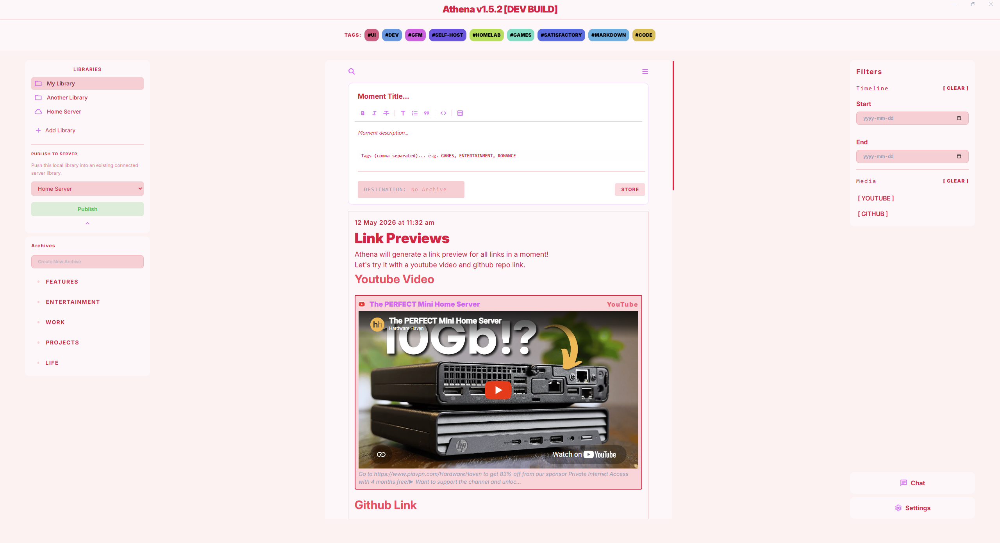
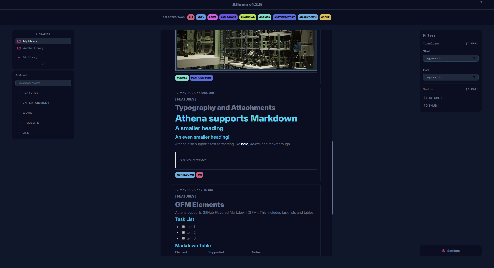

  

# Athena

    A simple, local-first journal and note taking application.

## Features
* **Offline-First:** Athena is completely usable even without an internet connection, with all data stored locally (see exception below).
* **Optional Online Servers:** Connect to a self-hosted Athena Server to securely sync libraries across devices and share with others via an IP and password. See the [Athena Server Repository](https://github.com/athenaeum-app/athena-server/blob/master/README.md) for more information.
* **Simple Organization:** Organize your thoughts into various Libraries, Archives, Moments, and use smart tags to organize and search your moments.
* **Rich Media & Link Previews:** Drop in images, videos, and links to automatically generate rich visual previews.
* **Markdown Support:** Create and edit moments using standard Markdown syntax.
* **GitHub Flavored Markdown (GFM):** Use enhanced Markdown rendering with GFM support for tables, task lists, and more.
* **Syntax Highlighting:** Code blocks within your moments will be highlighted using highlight.js for improved readability.
* **No Accounts Required:** Athena requires no accounts at all. Even for online-libraries. No need to keep track of another set of credentials.

---

## Images
### Rich Text & Markdown
Athena supports standard Markdown, link previews and file previews, as well as advanced GFM elements like tables and task lists.
| Markdown | GFM |
| :---: | :---: |
|  |  |

### Attachments & Media
Drop in your files or paste web links to automatically generate beautiful visual cards.
| Attachments | Link Previews |
| :---: | :---: |
|  |  |

### Self-hosted Online Libraries
Athena supports online libraries! No accounts needed, just an IP address and a password. Kept simple on purpose.

**For more information about client features, see the client repository below.**

---
## Main Repositories
* **[Athena Client](https://github.com/athenaeum-app/athena-client):** The desktop application.
* **[Athena Server](https://github.com/athenaeum-app/athena-server):** The optional Go-based backend. Deploy this to enable multi-device syncing, library sharing, and real-time chat.
